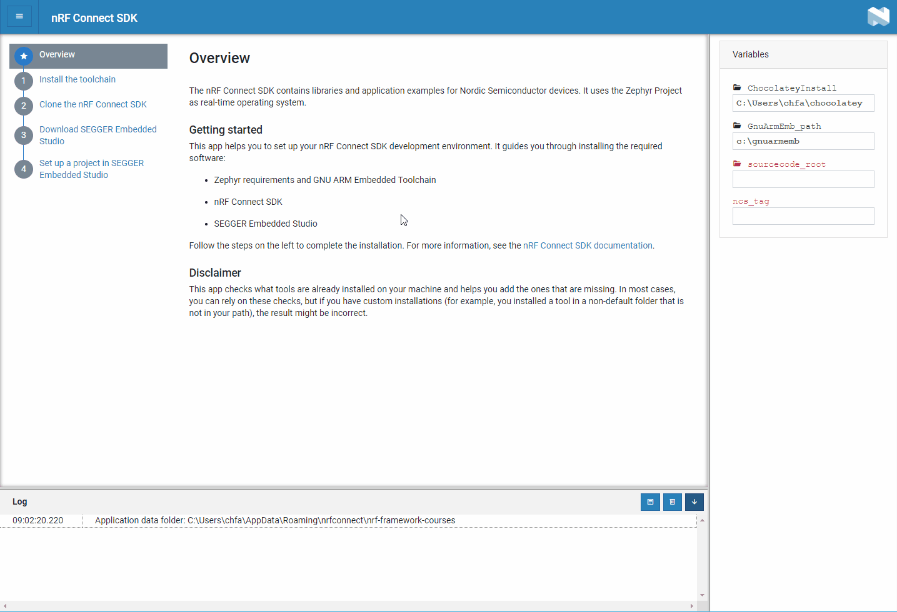

# nRF Connect Getting Started Assistant

*nRF Connect Getting Started Assistant* is a cross-platform tool guiding to set up the nRF Connect SDK.
It is implemented as an app in [nRF Connect for Desktop](https://github.com/NordicSemiconductor/pc-nrfconnect-core#nrf-connect).

## Installation

1. Download *nRF Connect for Desktop* from the [nRF Connect product page](https://www.nordicsemi.com/eng/Products/Bluetooth-low-energy/nRF-Connect-for-desktop)

2. Install *nRF Connect for Desktop* and open it

3. Find the app in the app list and click install

## Development

See the [nRF Connect app development](https://github.com/NordicSemiconductor/pc-nrfconnect-core/wiki) for details.

## Contributing

See the [Contributing](https://github.com/NordicSemiconductor/pc-nrfconnect-core/wiki/Contributing) for details.

## License

See the [LICENSE](LICENSE) for details.

## Feedback

* Ask questions on [DevZone Questions](https://devzone.nordicsemi.com)
* File code related issues on [GitHub Issues](https://github.com/NordicSemiconductor/pc-nrfconnect-gettingstarted/issues)
