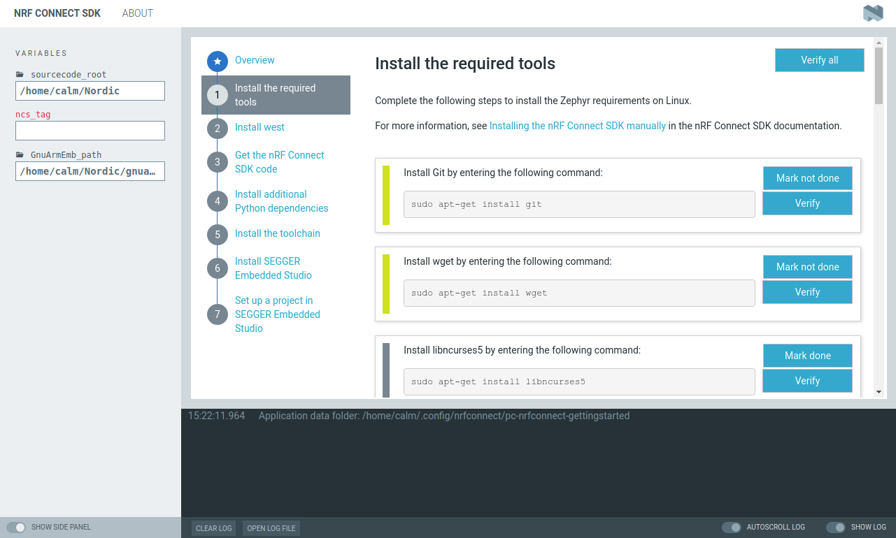

# nRF Connect Getting Started Assistant

*nRF Connect Getting Started Assistant* is a cross-platform tool guiding to set up the nRF Connect SDK.
It is implemented as an app for [nRF Connect](https://github.com/NordicSemiconductor/pc-nrfconnect-core#creating-apps).

## Installation

To install the application you can download binaries from the [nRF Connect product page](https://www.nordicsemi.com/eng/Products/Bluetooth-low-energy/nRF-Connect-for-desktop) on Nordic Semiconductor web pages.
After *nRF Connect* is installed, you can find it in the app list.

nRF Connect currently supports the following operating systems:

* Windows
* Ubuntu Linux 64-bit
* macOS

## Contributing

Feel free to file code related issues on [GitHub Issues](/issues) and/or submit a pull request. In order to accept your pull request, we need you to sign our Contributor License Agreement (CLA). You will see instructions for doing this after having submitted your first pull request. You only need to sign the CLA once, so if you have already done it for another project in the NordicSemiconductor organization, you are good to go.

## License

See the [license file](LICENSE) for details.

## Feedback

* Ask questions on [DevZone Questions](https://devzone.nordicsemi.com)
* File code related issues on [GitHub Issues](/issues)
